

    
    

# Node.js Blogging App

This Node.js application is a blogging platform built with TypeScript. It utilizes the EJS templating engine for views, TypeORM for interacting with a MySQL database, and incorporates user roles and middleware for authentication and authorization. The app allows users to view and read blog posts, and administrators can manage users, create new blog posts using Summernote for rich text editing, and handle file management with Multer.

## ScreenShoot

- `Page`

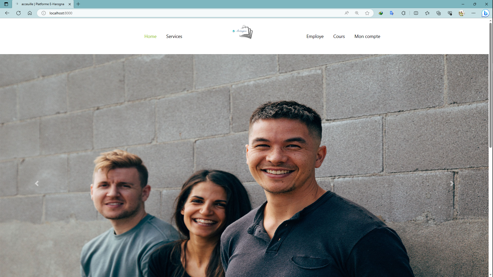
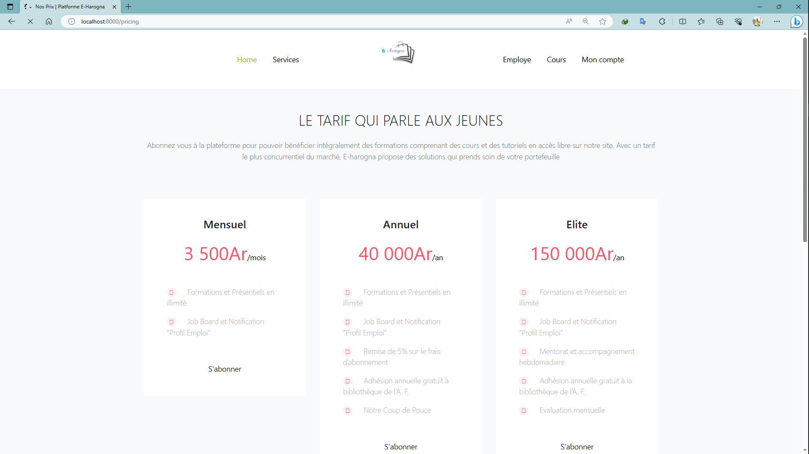
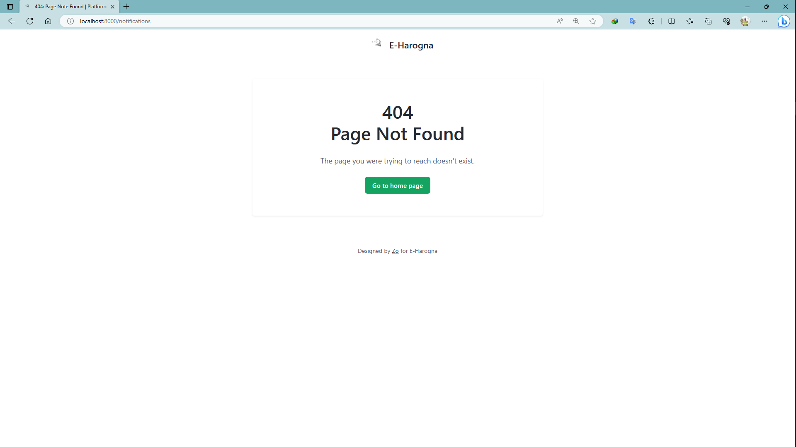

- `Blog`

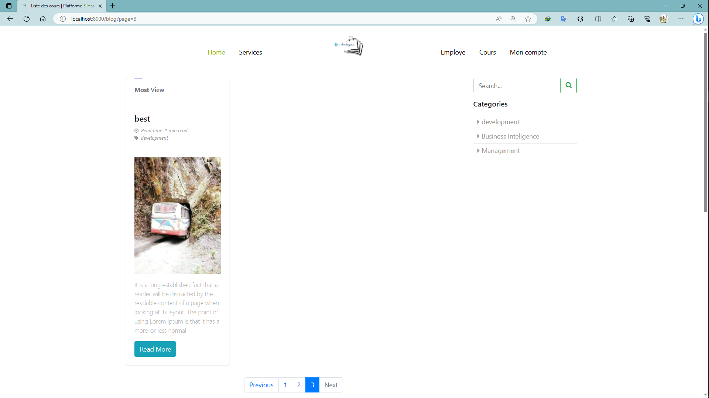
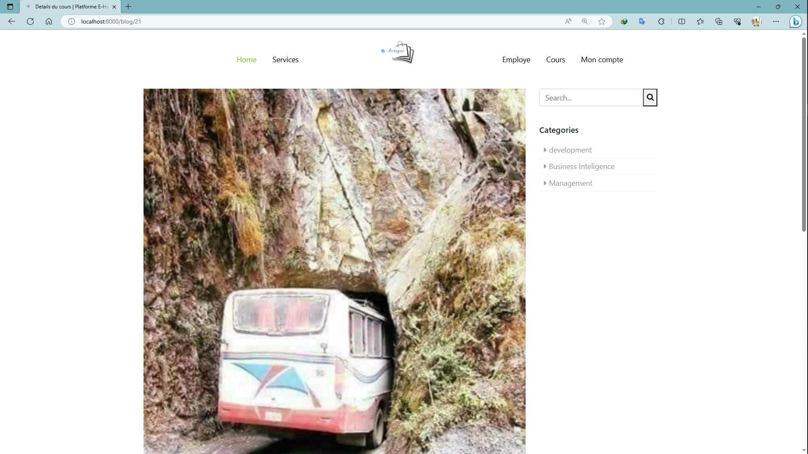
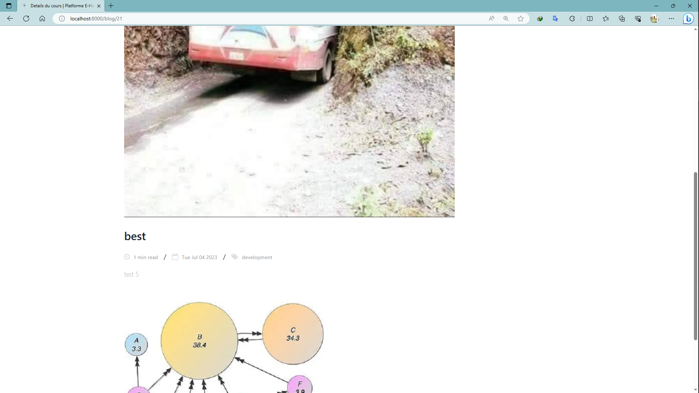

- `Authentification`

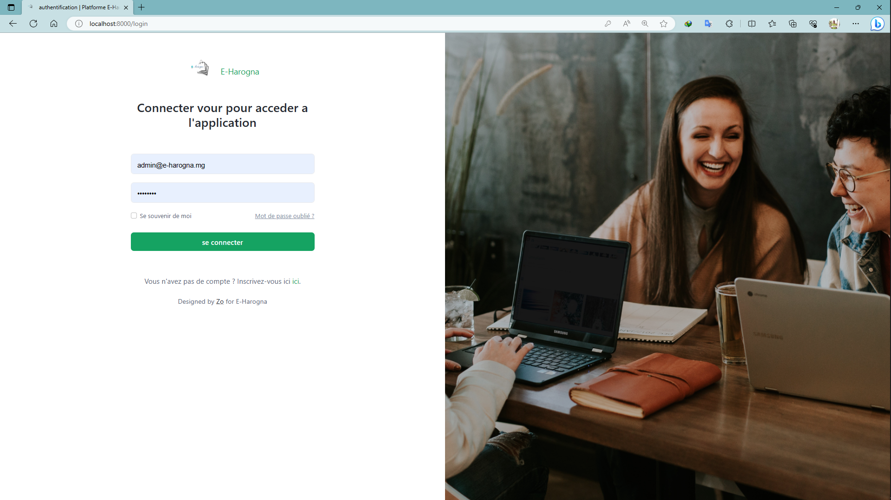
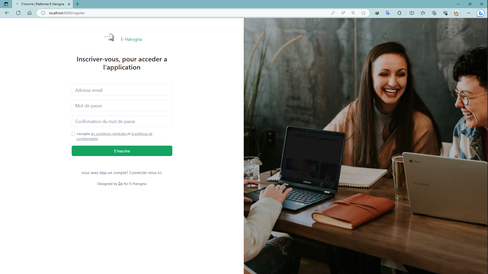
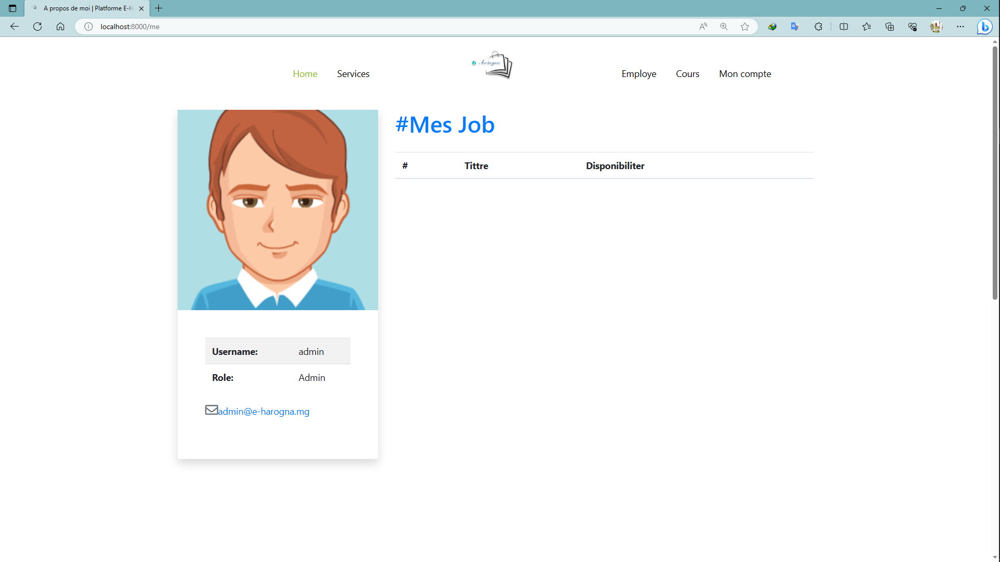

- `Admin`

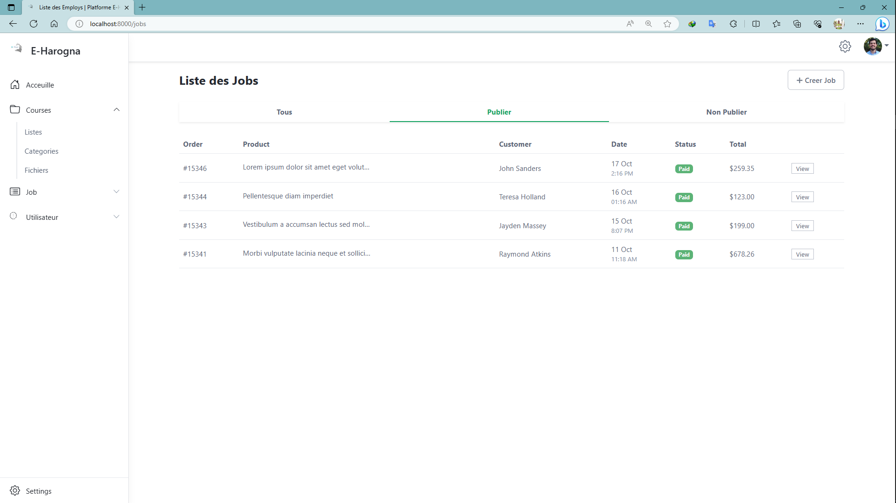
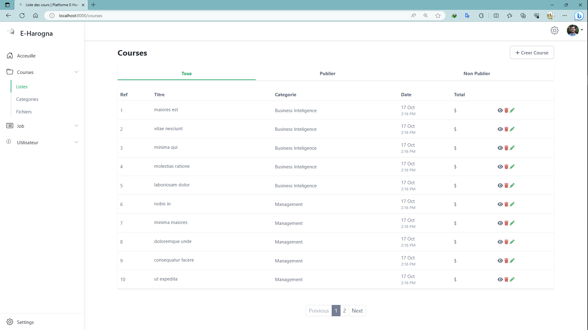
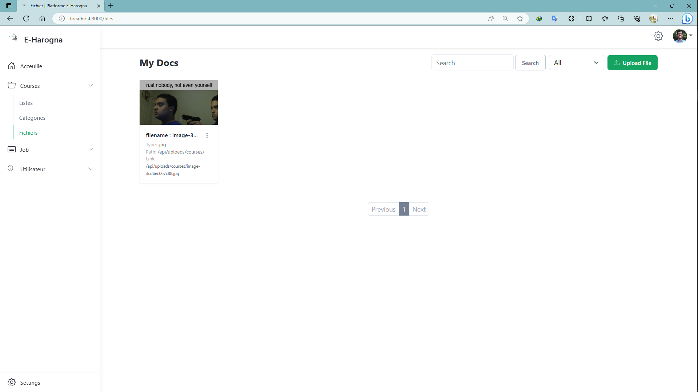

- `Form`

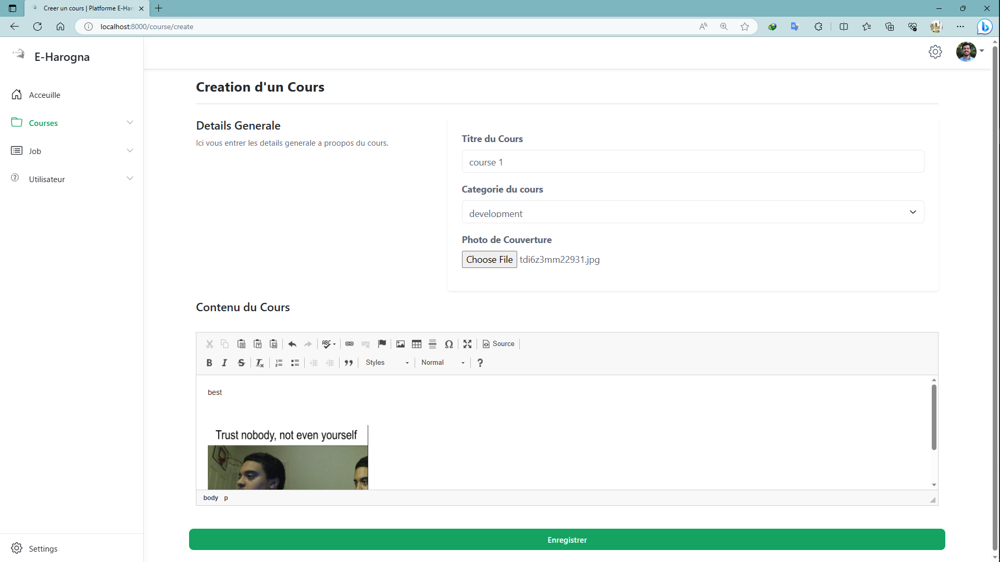

## Features

- **User Roles**: The application supports two user roles: "user" and "admin". Admin users have additional privileges for managing users and creating blog posts.
- **Authentication Middleware**: Middleware functions are implemented to handle user authentication and protect certain routes from unauthorized access.
- **EJS Views**: The app uses the EJS templating engine for rendering dynamic views, providing a flexible and customizable interface.
- **TypeORM**: TypeORM is utilized for interacting with the MySQL database, providing an object-relational mapping approach for seamless data management.
- **Blog Post Listing**: Users can browse and read blog posts on the app. The app also calculates the estimated reading time for each blog post using the `readTime` package.
- **Admin Panel**: Administrators have access to an admin panel where they can manage users and create new blog posts.
- **Rich Text Editing**: The Summernote library is integrated into the admin panel to provide a rich text editor for creating and formatting blog post content.
- **File Management**: Multer is used for handling file uploads and management in the application.

## Requirements

- Node.js (version 14.x or higher)
- npm (Node Package Manager)
- MySQL database

## Installation

1. Clone the repository or download the source code.
2. Install the dependencies by running `npm install` in the project root directory.
3. Set up a MySQL database and update the database connection configuration in the `ormconfig.json` file.
4. Run the database migrations by executing `npm run typeorm migration:run`.
5. Start the application by running `npm start`.
6. Open a web browser and visit `http://localhost:8000` to access the blogging app.

## Usage

- Register a new user account by clicking on the "Register" link on the homepage.
- Log in with your registered credentials on the login page.
- As a regular user:
  - Browse and read the blog posts on the homepage and individual blog post pages.
- As an admin user:
  - Access the admin panel by clicking on the "Admin Panel" link in the navigation menu.
  - Manage users: view all users, view user details, update user information, and delete users.
  - Create new blog posts: click on the "Create Post" button, use the Summernote editor to write the content, and submit the form.
- Log out by clicking on the "Logout" link in the navigation menu.

Below is the list of packages used in the Node.js Blogging App:

## Production Dependencies

- `@sendgrid/mail`: Library for sending emails using the SendGrid service.
- `bcryptjs`: Library for hashing and comparing passwords securely.
- `body-parser`: Middleware for parsing incoming request bodies.
- `connect-flash`: Flash messages middleware for displaying temporary messages to the user.
- `cookie-parser`: Middleware for parsing cookies.
- `cors`: Middleware for handling Cross-Origin Resource Sharing (CORS) headers.
- `dotenv`: Library for loading environment variables from a `.env` file.
- `ejs`: Embedded JavaScript templating engine for rendering views.
- `env-cmd`: Utility for executing commands with environment variables loaded from a file.
- `express`: Fast and minimalist web framework for Node.js.
- `express-session`: Session middleware for Express.js.
- `express-validation`: Middleware for request validation in Express.js.
- `faker`: Library for generating fake data.
- `json2csv`: Library for converting JSON data to CSV format.
- `jsonwebtoken`: Library for creating and verifying JSON Web Tokens (JWT).
- `multer`: Middleware for handling multipart/form-data, used for file uploads.
- `mysql2`: MySQL database client for Node.js.
- `nodemailer`: Library for sending emails.
- `nodemailer-sendinblue-transport`: Nodemailer transport plugin for sending emails using SendinBlue service.
- `reading-time`: Library for estimating the reading time of a text.
- `reflect-metadata`: Polyfill for the Metadata Reflection API.
- `ts-node`: TypeScript execution environment and REPL for Node.js.
- `typeorm`: Object-relational mapping (ORM) library for TypeScript and JavaScript.
- `typescript`: Programming language that adds static type-checking to JavaScript.

## Development Dependencies

- `@types/bcryptjs`: Type definitions for bcryptjs library.
- `@types/connect-flash`: Type definitions for connect-flash library.
- `@types/cookie-parser`: Type definitions for cookie-parser library.
- `@types/cors`: Type definitions for cors library.
- `@types/express`: Type definitions for express library.
- `@types/express-session`: Type definitions for express-session library.
- `@types/faker`: Type definitions for faker library.
- `@types/json2csv`: Type definitions for json2csv library.
- `@types/jsonwebtoken`: Type definitions for jsonwebtoken library.
- `@types/multer`: Type definitions for multer library.
- `@types/node`: Type definitions for Node.js.
- `@types/nodemailer`: Type definitions for nodemailer library.

## Contribution

Contributions to this project are welcome. If you have any suggestions, bug fixes, or new features to propose, please open an issue or submit a pull request.

## License

This Node.js Blogging App is released under the [ISC License](https://opensource.org/licenses/ISC).

## Contact

    
    

